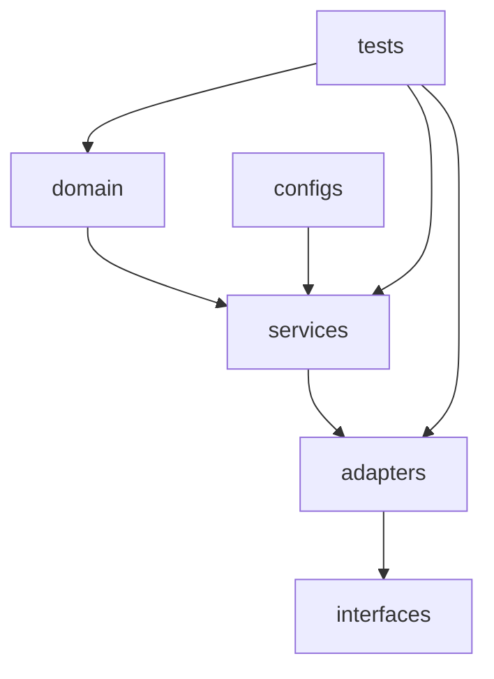

# 《程式碼方法論》
*(Code Engineering Methodology – Modular, Layered, Testable)*

## 一、導論：從程式到系統

傳統的程式開發常以「單一應用」為出發點。
當功能增長、版本增加、團隊擴大時，就會面臨三大問題：

* **難以維護**：重複邏輯散落在多個檔案中。
* **難以重用**：功能無法跨專案引用。
* **難以測試**：程式邏輯與環境強耦合，缺乏可抽換性。

**程式碼方法論（Code Engineering Methodology）** 提出一種系統化結構：

> 把程式碼視為「可重組的模組」，
> 以「分層、解耦、測試」為核心原則，
> 讓每一行程式碼都有其邏輯位置與生命週期。

---

## 二、核心原則（The Core Principles）

| 原則 | 名稱                            | 核心理念            | 實踐方式                                    |
| -- | ----------------------------- | --------------- | --------------------------------------- |
| P1 | 程式碼即邏輯單元                      | 程式碼不是執行體，而是邏輯模組 | 以功能模組形式儲存、版本化                           |
| P2 | 單一職責原則 (SRP)                  | 每個模組只負責一件事      | 拆分檔案至 `domain/`, `service/`, `adapter/` |
| P3 | 關注點分離 (SoC)                   | 資料、邏輯、界面分層      | 使用清楚的目錄層級                               |
| P4 | 組合優於繼承                        | 功能透過組裝而非繼承延伸    | 實作 dependency injection                 |
| P5 | DRY 原則                        | 不重複邏輯           | 抽取通用函式、封裝工具                             |
| P6 | 宣告式建構                         | 明確定義依賴關係        | 在組裝層 (`app/`) 宣告依賴模組                    |
| P7 | SSOT (Single Source of Truth) | 系統中資訊僅存在唯一來源    | 使用統一 config/schema                      |
| P8 | 可測試性                          | 一切模組皆可單獨驗證      | 單元測試 + 模擬測試 + 整合測試                      |

---

## 三、程式層級架構設計

### 📦 目錄結構（範例）

```
core/
 └─ code/
     ├─ domain/         # 核心業務邏輯（不依賴外部框架）
     │   ├─ user.py
     │   └─ report.py
     ├─ services/       # 邏輯服務層，封裝操作流程
     │   ├─ report_service.py
     │   └─ auth_service.py
     ├─ adapters/       # 外部介面層（API, DB, Prompt, File IO）
     │   ├─ db_adapter.py
     │   ├─ api_adapter.py
     │   └─ prompt_adapter.py
     ├─ interfaces/     # 對外公開的應用入口（可給 UI, CLI, API 用）
     │   └─ controller.py
     ├─ configs/
     │   ├─ schema.json
     │   └─ settings.yaml
     └─ tests/
         ├─ test_unit/
         ├─ test_integration/
         └─ test_e2e/
```

這個結構的邏輯是：

* **domain** → 最純邏輯，不依賴外部世界
* **services** → 管理業務流程（調用多個 domain）
* **adapters** → 與外部世界互動
* **interfaces** → 給使用者或其他系統呼叫
* **configs** → 定義唯一真實狀態 (SSOT)
* **tests** → 驗證整個系統可用性

---

## 四、程式模組的設計方法

### P1：程式碼即邏輯單元

程式碼不只是跑起來的功能，它代表一段「意圖」。
例如：

```python
# domain/report.py
class ReportAnalyzer:
    """分析報告的業務邏輯，不涉及外部資料來源"""
    def summarize(self, text: str) -> dict:
        # 純邏輯
        ...
```

這樣的模組可以被 service 或 adapter 任意調用、測試、替換。

---

### P2：單一職責原則

不要讓一個檔案同時：

* 處理資料庫連線
* 格式化輸出
* 做業務邏輯

應該拆成：

```
adapters/db_adapter.py
domain/report.py
services/report_service.py
```

---

### P3：關注點分離

**不要混在一起**。
邏輯、資料、輸入輸出應清楚分離：

| 層級        | 功能     | 範例                       |
| --------- | ------ | ------------------------ |
| domain    | 純邏輯    | 規則、演算法、資料模型              |
| services  | 管理流程   | 驗證、呼叫 domain、組合結果        |
| adapters  | 外部系統   | DB / API / Prompt        |
| interface | 對外 API | FastAPI Controller 或 CLI |

---

### P4：組合優於繼承

錯誤示範：

```python
class SpecialReportAnalyzer(ReportAnalyzer):
    ...
```

這樣繼承會破壞封裝。
改成：

```python
class ReportPipeline:
    def __init__(self, analyzer: ReportAnalyzer, formatter: ReportFormatter):
        self.analyzer = analyzer
        self.formatter = formatter
```

---

### P5：DRY 原則

相同功能（如日誌、格式化）只存在一份。

```python
# utils/logger.py
def log(message: str): ...
```

任何地方需要記錄，都引入 `logger`，而不是重寫。

---

### P6：宣告式建構

應用層只**宣告**需要哪些模組，而不描述怎麼做。

```python
# app.py
from services.report_service import ReportService
from adapters.db_adapter import Database
from adapters.prompt_adapter import PromptConnector

def build_app():
    db = Database()
    prompt = PromptConnector()
    return ReportService(db, prompt)
```

---

### P7：SSOT

例如設定檔、資料結構統一：

```json
{
  "project_spec": {
    "intent": "string",
    "summary": "string",
    "report": "object"
  }
}
```

所有模組都讀取這個 schema，而非各自定義。

---

### P8：可測試性

每個層級都能獨立測試：

```python
# tests/test_report.py
from domain.report import ReportAnalyzer

def test_summary_generation():
    analyzer = ReportAnalyzer()
    result = analyzer.summarize("AI transforms industry.")
    assert "AI" in result["keywords"]
```

---

## 五、VSCode + GitHub 實作流程

| 階段   | 動作                             | 工具                   |
| ---- | ------------------------------ | -------------------- |
| 編輯   | 撰寫 domain/service/adapters     | VSCode               |
| 組裝   | `python -m app` 或 `make build` | Terminal             |
| 測試   | `pytest`                       | VSCode Testing Panel |
| 版本管理 | `git commit` / `git push`      | GitHub               |
| 驗證   | CI 驗證測試 + coverage             | GitHub Actions       |
| 發佈   | 發 tag + release                | 自動部署                 |

---

## 六、資料夾與組織關係（概念圖）



---

## 七、結語：帶來的價值

| 面向   | 成果                            |
| ---- | ----------------------------- |
| 可維護性 | 清楚分層，修改影響範圍明確                 |
| 可重用性 | 功能模組可跨專案共用                    |
| 可測試性 | 單元、整合測試結構固定                   |
| 可版本化 | 程式模組可版本標註與回溯                  |
| 可擴展性 | 任意新增 adapter / service，不破壞原結構 |

> **總結：**
>
> 程式碼不再是雜亂的命令集合，而是有邏輯、有層次、有版本的知識體系。
> 這正是「程式碼即邏輯模組」的真正精神。

