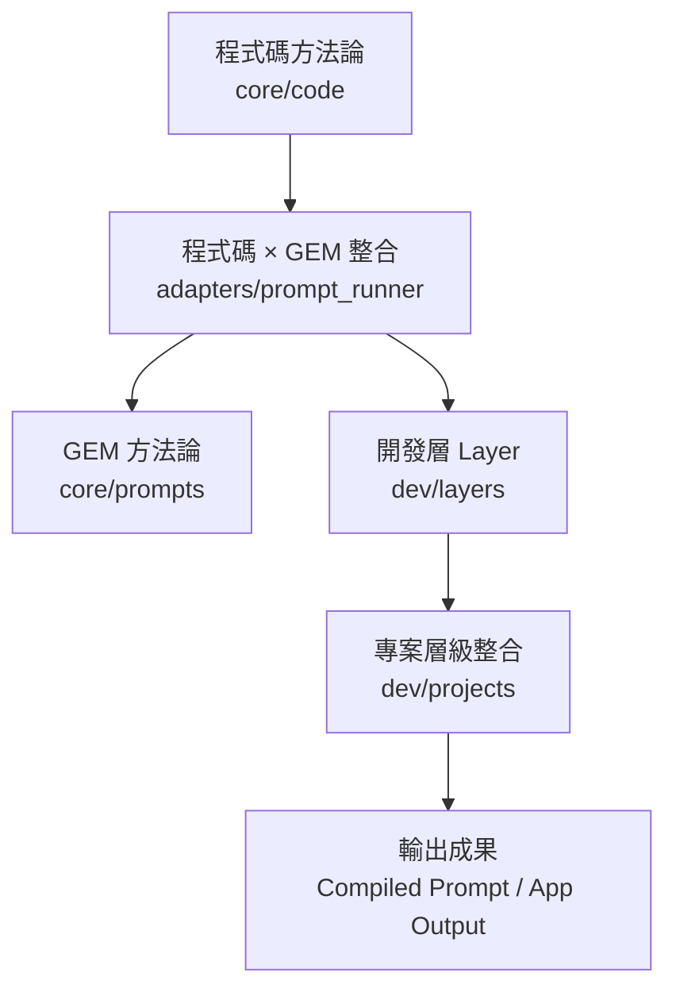
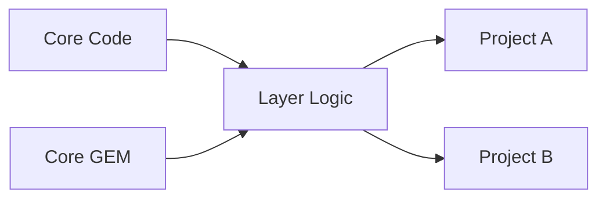
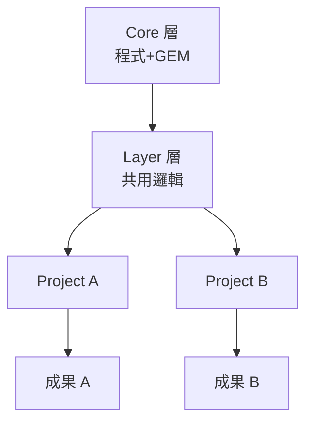

## 🧩 一、這四份方法論的資料結構是「可串起來」的（而且就是設計來串的）

先看它們在邏輯與資料層的對應關係👇

| 文件                      | 對應層級              | 主要資料結構                                            | 與其他層的關係                      |
| ----------------------- | ----------------- | ------------------------------------------------- | ---------------------------- |
| **1️⃣ 程式碼方法論**          | Core - Code 層     | `core/code/`                                      | 提供邏輯與運算基礎（可被 GEM 與 Layer 調用） |
| **2️⃣ GEM 方法論**         | Core - Prompt 層   | `core/prompts/`                                   | 提供語義邏輯（由 Code 或 Layer 組裝呼叫）  |
| **3️⃣ 程式碼 × GEM 整合方法論** | Core ↔ Layer 接口層  | `dev/layers/logic/` + `adapters/prompt_runner.py` | 建立 Code 與 GEM 互相溝通的橋樑        |
| **4️⃣ 專案層級整合方法論**       | Layer ↔ Project 層 | `dev/projects/`                                   | 實際將 Core 與 Layer 組裝成可運行應用    |

換句話說：

> 這四份文件代表的是四層結構的「治理分層」與「資料流鏈」。

整體可視為一條 **可貫通的管線**：



這條鏈條確保了：

* **同一份邏輯可被跨專案重用**
* **所有組件都能版本化追蹤**
* **所有輸出（Prompt / Code）都有測試與版本記錄**
* **所有層級都能在 VS Code 內直接看得到、編輯得到**

---

## 🧱 二、「開發層 (Layer)」是什麼？

這是許多人第一次看這種分層時會困惑的關鍵。
它其實是 **Core 層與 Project 層之間的橋樑層**。
用一句話解釋：

> **開發層是「通用邏輯與專案應用之間的抽象層」。**
> 它讓專案不用直接接觸底層 Core，也能靈活地使用功能。

---

### 📘 層級定位對照表

| 層級               | 角色定位   | 說明                      |
| ---------------- | ------ | ----------------------- |
| **Core 層**       | 穩定基底   | 放所有共用的邏輯（Code + GEM）    |
| **Layer 層（開發層）** | 框架／抽象層 | 把 Core 模組封裝成可供專案快速組裝的框架 |
| **Project 層**    | 實作應用   | 實際的應用與使用案例              |
| **Docs 層（選用）**   | 知識與管理層 | 紀錄所有方法論、配置與治理文件         |

---

### 🧠 開發層實際做什麼？

| 功能            | 說明                                             | 範例                                                            |
| ------------- | ---------------------------------------------- | ------------------------------------------------------------- |
| 🧩 封裝 Core 功能 | 把 Core 的 Code + GEM 模組整合成通用方法                  | `logic/report_pipeline.py` 封裝 `ReportService` + `gem_summary` |
| ⚙️ 定義共用流程     | 寫成標準的作業流程                                      | `foundation/pipeline_template.py`                             |
| 🧱 建立專案模板     | 專案的初始化結構、範例 recipe、測試樣板                        | `_template/`                                                  |
| 🔌 提供對外 API   | 定義 Layer → Project 的介面                         | `interface/project_runner.py`                                 |
| 🧰 提供工具       | 工具類，如 `validate_schema.py`, `sync_registry.py` | dev/layers/tools/                                             |

---

### 📂 開發層結構範例

```
dev/
 ├─ layers/
 │   ├─ foundation/           # 基礎設定與共用規範
 │   │   ├─ schema.json
 │   │   └─ config_template.yaml
 │   ├─ logic/                # 核心組裝邏輯
 │   │   ├─ pipeline_base.py
 │   │   ├─ prompt_orchestrator.py
 │   │   └─ project_initializer.py
 │   ├─ interface/            # 對專案層提供的統一 API
 │   │   ├─ layer_api.py
 │   │   └─ layer_adapter.py
 │   └─ tools/                # 層級工具（驗證、同步）
 │       ├─ validate_recipe.py
 │       └─ sync_registry.py
```

---

### 🔄 資料流範例（開發層的角色）



開發層負責：

* 把核心模組轉成**可直接呼叫的工具或框架**
* 提供標準流程給所有專案使用
* 成為「防止專案直接依賴底層」的隔離層

---

## 💡 你可以這樣理解四層系統：

| 層級             | 主要責任                | 說明                     |
| -------------- | ------------------- | ---------------------- |
| **Core**       | 穩定的功能模組（Code + GEM） | 實作細節、重用邏輯              |
| **Layer（開發層）** | 框架與流程               | 封裝 Core 功能成共用管線        |
| **Project**    | 實際應用                | 使用 Layer API 與 Core 組件 |
| **Docs**       | 知識治理                | 管理方法論與規範文件             |

整體看起來會像：



---

## ⚙️ 為什麼要有「開發層」

| 問題      | 如果沒有開發層會發生什麼      | 有開發層後的改進       |
| ------- | ----------------- | -------------- |
| 多專案共用邏輯 | 每個專案各自複製 Core     | 由 Layer 統一封裝   |
| 版本同步    | Core 更新會影響所有專案    | Layer 做中介緩衝    |
| 跨專案開發   | 難以建立標準範例          | Layer 提供模板與工具  |
| 組裝流程    | 每個專案各自定義 build 規則 | Layer 統一組裝流程   |
| 測試機制    | 測試不一致             | Layer 提供標準測試入口 |

---

## ✅ 小結：資料結構怎麼「串起來」

四層（Core / Layer / Project / Docs）是縱向貫通的系統：

```
Docs (方法論與規範)
   ↓
Core (程式碼與 GEM)
   ↓
Layer (共用開發層)
   ↓
Project (應用層)
```

這樣一來：

* 所有專案共享相同的基礎結構（Core）
* 所有開發行為經由 Layer 管理（統一測試、部署、組裝）
* 專案開發者專注在應用而非維護底層
* 整個系統形成**互通、可治理、可視化的架構鏈**

---

是否希望我幫你把這個整合關係（Core ↔ Layer ↔ Project ↔ Docs）
整理成一份視覺化「全域資料架構圖 + 對應資料夾設計」的文件？
我可以用 Markdown + Mermaid 圖把整體邏輯清楚畫出來。
