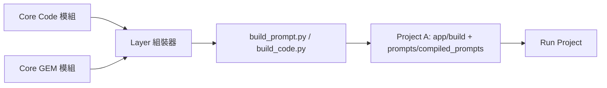
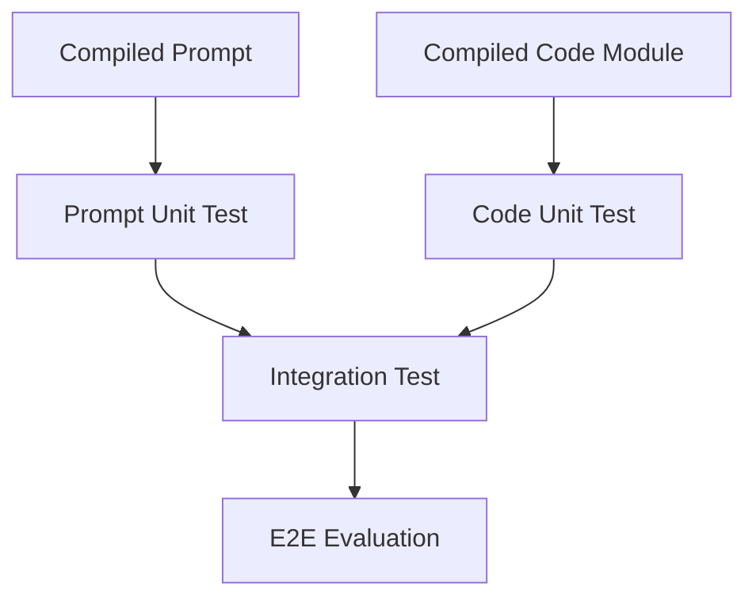

## 🧩 一、基本原則：組裝成品屬於「Project 層」

### ✳️ 原因：

* Core、Layer 是**可重用邏輯層**，不應該有「運行時產物」
* 組裝結果是**專案執行上下文**的結果（含特定版本、依賴、輸入結構）
* Prompt 與 Code 組裝後屬於「應用可執行單位」

👉 所以組裝好的成品**要放在 Project 層**的明確資料夾裡。

---

## 📦 二、建議目錄結構（完整範例）

```
dev/
 └─ projects/
     ├─ proj-A/
     │   ├─ app/                     # 組裝後的應用邏輯（Code）
     │   │   ├─ build/               # 自動組裝生成區
     │   │   │   ├─ modules/         # 組裝後可執行 Python 模組
     │   │   │   └─ pipelines/       # 組合後的流程
     │   │   ├─ main.py              # 專案進入點
     │   │   ├─ run.sh               # 執行腳本
     │   │   └─ config.yaml
     │   │
     │   ├─ prompts/
     │   │   ├─ recipes/             # 組裝宣告
     │   │   ├─ compiled_prompts/    # ✅ 組裝後成品（Prompt）
     │   │   ├─ evals/               # 測試用例
     │   │   └─ lockfile.json        # 組件版本鎖
     │   │
     │   ├─ ssot/schema.json         # 專案共用資料結構
     │   └─ tests/                   # 專案層測試
```

---

## ⚙️ 三、組裝與產出規範

| 類別             | 產出檔案            | 放置位置                        | 說明                   |
| -------------- | --------------- | --------------------------- | -------------------- |
| **組裝後 Code**   | `.py` / `.json` | `app/build/modules/`        | Layer 自動組合的邏輯模組      |
| **組裝後 Prompt** | `.md`           | `prompts/compiled_prompts/` | GEM + Component 組合結果 |
| **Recipe 宣告**  | `.json`         | `prompts/recipes/`          | 組裝配置來源               |
| **Lockfile**   | `.json`         | `prompts/lockfile.json`     | 指定版本依賴               |
| **測試與驗證**      | `.py` / `.yaml` | `tests/`                    | 驗證組裝成品是否能跑通          |
| **執行入口**       | `main.py`       | `app/`                      | 呼叫編譯後模組與 prompt      |

---

## 🧱 四、組裝流程（程式碼與 Prompt 並行）



1️⃣ Layer 組裝器（例如 `build_code.py`, `build_prompt.py`）
　→ 讀取 Core 內模組與 GEM 結構。
2️⃣ 解析 Project 的 Recipe / Config。
3️⃣ 組合成可執行模組或 prompt。
4️⃣ 成品存入 Project 專屬的組裝區。

---

## 🔧 五、組裝工具對應表

| 工具                  | 功能                            | 輸出位置                         |
| ------------------- | ----------------------------- | ---------------------------- |
| `build_code.py`     | 組合 Code 模組成可執行流程              | `app/build/modules/`         |
| `build_prompt.py`   | 組合 GEM + Component 成完整 Prompt | `prompts/compiled_prompts/`  |
| `prompt_preview.py` | 預覽 Prompt 組裝結果                | 終端輸出                         |
| `prompt_diff.py`    | 比較新舊版本差異                      | 終端輸出                         |
| `publish_gem.py`    | 發佈 GEM 版本                     | `core/prompts/registry/`     |
| `validate_spec.py`  | 驗證專案設定與 Schema                | `dev/projects/<proj>/tests/` |

---

## 🔐 六、執行層與測試層關係



* Prompt 與 Code 的組裝成品**各自測試**
* 最後由整合測試（Integration Test）驗證交互邏輯
* 最終用端對端測試（E2E）確認整體行為

---

## 💾 七、版本與產物治理

| 產物類型              | 管理策略                    |
| ----------------- | ----------------------- |
| Core Code / GEM   | 放在 `core/` 並由 GitHub 管理 |
| 組裝後 Code          | 不進 Git，僅做編譯產物           |
| 組裝後 Prompt        | 可選進 Git（若要審查或回溯）        |
| Recipe / Lockfile | 一定要進 Git（為版本證據）         |
| 測試結果 / Evals      | 可儲存在 `docs/evals/` 供回溯  |

> 💡 小建議：
> Prompt 的成品 `.md` 若屬關鍵任務，可以**納入 Git 並上傳審核記錄**；
> Code 的 build 結果通常由 CI 自動生成，不建議手動追蹤。

---

## 🧠 八、VS Code 實作建議

在 `.vscode/tasks.json` 中可新增兩個自動任務：

```json
{
  "version": "2.0.0",
  "tasks": [
    {
      "label": "🔧 Build Project Code",
      "type": "shell",
      "command": "python dev/layers/tools/build_code.py --project ${workspaceFolder}/dev/projects/proj-A",
      "group": "build"
    },
    {
      "label": "🧠 Build Project Prompt",
      "type": "shell",
      "command": "python core/prompts/tools/build_prompt.py --recipe ${workspaceFolder}/dev/projects/proj-A/prompts/recipes/spec_demo.json",
      "group": "build"
    }
  ]
}
```

這樣你只要在 VS Code 中按 **Ctrl + Shift + B**，
就能同時組裝 Code 與 Prompt，結果自動放入對應資料夾。

---

## ✅ 九、小結：存放邏輯一覽表

| 類別                   | 所屬層級    | 存放位置                                            | 是否版本控管  |
| -------------------- | ------- | ----------------------------------------------- | ------- |
| 核心模組 (Code/GEM)      | Core    | `core/`                                         | ✅       |
| 共用框架 (Layer)         | Layer   | `dev/layers/`                                   | ✅       |
| 組裝宣告 (Recipe/Config) | Project | `dev/projects/<proj>/prompts/recipes/`          | ✅       |
| 組裝成品 (Prompt)        | Project | `dev/projects/<proj>/prompts/compiled_prompts/` | ✅ / 可選  |
| 組裝成品 (Code)          | Project | `dev/projects/<proj>/app/build/`                | ❌（暫存產物） |
| 測試與評估                | Project | `dev/projects/<proj>/tests/`                    | ✅       |
| 文件與規範                | Docs    | `docs/methods/`                                 | ✅       |

---

> **一句話總結：**
> 組裝好的 Code 與 Prompt 不屬於 Core，也不屬於 Layer，
> 它們是「**專案層級的最終執行產物**」。
>
> 所以 ——
> ✅ Core 提供可重用邏輯，
> ✅ Layer 提供組裝與框架，
> ✅ Project 保存最終成品。

---

是否希望我幫你畫一張「**從 Core 到 Project 的產物流動與檔案歸屬圖**」？
用 Mermaid 直接視覺化每個輸出從哪裡來、存在哪裡、誰用到。
