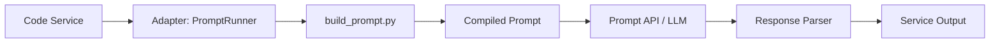

# 《程式碼 × Prompt模組化整合方法論》

*(Unified Modular Integration Methodology – Bridging Code and Prompt Logic)*


## 一、導論：邏輯的雙軌融合

隨著 AI 專案的成熟，**程式碼（Code）** 與 **提示詞模組（GEM）**
已經不再是兩個獨立世界，而是互相依存的邏輯體系。

* **程式碼** 處理邏輯運算、資料流與系統行為。
* **GEM** 處理語義分析、生成邏輯與語言輸出。

然而，若兩者分離維護，會出現三個問題：

1. 程式邏輯與語義邏輯無法同步版本控制。
2. 開發者與提示詞工程師各自改動，導致互不相容。
3. 測試與部署流程難以統一。

**整合方法論 (Unified Integration Methodology)**
的目標是建立一個「**雙軌融合層級結構**」，
讓程式與 GEM 能夠共用相同的原則、資料結構、版本控制與測試流程。

---

## 二、核心原則（Unified Principles）

| 原則 | 名稱      | 核心理念                   | 實踐方式                       |
| -- | ------- | ---------------------- | -------------------------- |
| P1 | 雙軌對等    | Code 與 GEM 同層、可互相調用    | 平行資料夾結構                    |
| P2 | 職責邊界清晰  | Code 控邏輯、GEM 控語義       | 建立明確接口層                    |
| P3 | 共享 SSOT | 共用統一的狀態模型              | `ssot/schema.json`         |
| P4 | 宣告式整合   | 在 Recipe 層統一宣告兩邊依賴     | 組裝器 + registry             |
| P5 | 可版本化整合  | GEM 與 Code 均有版本與依賴鎖    | `lockfile`                 |
| P6 | 測試可對應   | 可從相同輸入測試兩邏輯分支          | Integration test framework |
| P7 | 平台級治理   | 統一 CI/CD pipeline 驗證雙軌 | GitHub Actions             |
| P8 | IDE 可視化 | VS Code 一鍵操作雙層結構       | Task + Extension 整合        |

---

## 三、雙軌資料結構設計

### 📦 結構概觀

```
core/
 ├─ code/                  # 程式邏輯層
 │   ├─ domain/
 │   ├─ services/
 │   ├─ adapters/
 │   └─ tests/
 └─ prompts/               # 語義邏輯層 (GEM)
     ├─ components/
     ├─ gems/
     ├─ registry/
     └─ tools/
dev/
 └─ projects/
     ├─ proj-A/
     │   ├─ ssot/schema.json
     │   ├─ app/           # 整合組裝層
     │   ├─ prompts/
     │   │   ├─ recipes/
     │   │   └─ compiled_prompts/
     │   └─ tests/
     └─ proj-B/
```

---

## 四、整合設計理念

### 🧠 一、邏輯分工

| 層級        | 控制範圍           | 範例                            |
| --------- | -------------- | ----------------------------- |
| Code 層    | 邏輯決策、流程、資料驗證   | service, adapter, api         |
| GEM 層     | 語意理解、自然語言輸出    | component, recipe             |
| SSOT      | 共享資料模型         | project_spec.intent / summary |
| 組裝層 (App) | Code + GEM 整合點 | build pipeline / orchestrator |

---

### ⚙️ 二、整合流程範例

1️⃣ **在程式端呼叫 GEM**

```python
from adapters.prompt_adapter import PromptRunner

runner = PromptRunner(gem="gem_knowledge_extractor", recipe="demo_research")
result = runner.run(input_data)
```

2️⃣ **PromptRunner 處理邏輯**

```python
class PromptRunner:
    def __init__(self, gem, recipe):
        self.gem = gem
        self.recipe = recipe

    def run(self, data):
        compiled_prompt = self._compile_prompt()
        response = self._execute_prompt(compiled_prompt, data)
        return self._parse_output(response)

    def _compile_prompt(self):
        os.system(f"python core/prompts/tools/build_prompt.py --recipe {self.recipe}")
        return Path(f"compiled_prompts/{self.recipe}.md").read_text()
```

---

## 五、整合層中的 SSOT 共用設計

> SSOT（Single Source of Truth）是雙軌整合的橋樑。

```json
{
  "project_spec": {
    "intent": "string",
    "summary": "string",
    "report": "object"
  },
  "runtime_state": {
    "last_prompt_sha": "string",
    "version": "string"
  }
}
```

* **程式碼端**：透過 schema 驗證輸入輸出格式。
* **GEM 端**：以 `reads/writes` 明確宣告資料流。
* **整合器**：保證兩邊欄位一致，並生成 Lockfile。

---

## 六、整合組裝流程



1. 程式呼叫整合層（PromptRunner）。
2. PromptRunner 觸發 `build_prompt.py`。
3. 組裝器從 Recipe 組出最終 Prompt。
4. 送入 LLM，取得結果。
5. 回傳並存入 SSOT。

---

## 七、VS Code 操作與 GitHub 流程

| 階段   | 動作                  | 工具              |
| ---- | ------------------- | --------------- |
| 開發   | 編寫 code + GEM       | VS Code         |
| 組裝   | build_prompt.py     | Terminal / Task |
| 測試   | pytest / eval       | Testing Panel   |
| 整合測試 | test_integration.py | VS Code Debug   |
| 發佈   | git push + CI       | GitHub          |
| 部署   | GitHub Actions      | 雙軌自動化 pipeline  |

### 🧩 VS Code 整合小技巧

* `.vscode/tasks.json` 中同時設置：

  * `Build Prompt`
  * `Run Service`
  * `Run Integration Test`
* 在 `launch.json` 中配置 Python 偵錯 GEM 組裝過程。
* 用 `prompt_catalog.py` 可視化對應關係（Code 模組 ↔ GEM 模組）。

---

## 八、版本控制與 Lockfile 機制

| 層級      | 控制檔案                                  | 功能              |
| ------- | ------------------------------------- | --------------- |
| Code    | `pyproject.toml` / `requirements.txt` | 套件與版本           |
| GEM     | `core/prompts/registry/index.json`    | 模組版本            |
| Project | `gems.lock.json`                      | 鎖定各專案使用的 GEM 版本 |
| CI/CD   | `build_manifest.json`                 | 追蹤 build SHA    |

---

### 🔒 Lockfile 範例

```json
{
  "project": "proj-A",
  "gems": {
    "gem_knowledge_extractor": "1.0.0",
    "gem_code_audit": "0.9.2"
  },
  "compiled_at": "2025-11-06T09:00:00Z"
}
```

---

## 九、測試與驗證架構

| 測試類型  | 範圍               | 工具             |
| ----- | ---------------- | -------------- |
| 單元測試  | 單一模組（Code 或 GEM） | pytest         |
| 整合測試  | Code ↔ GEM 互動    | pytest + mock  |
| 端對端測試 | 整體流程             | eval script    |
| 回歸測試  | 新舊版本比較           | prompt_diff.py |

---

## 十、整合方法論的價值

| 面向   | 成果                    |
| ---- | --------------------- |
| 統一性  | Code 與 Prompt 可同版管理   |
| 穩定性  | SSOT 確保雙邏輯一致          |
| 可測試性 | 整合測試確保可靠性             |
| 可維護性 | 結構分明、層層獨立             |
| 可擴展性 | 新 GEM、新 Service 可自由組合 |

---

> **總結：**
>
> 「程式碼 × GEM 整合方法論」讓軟體邏輯與生成邏輯共生。
> 你的 AI 系統從此不再是兩套架構，而是一個雙軌、分層、可測試、可治理的完整體系。

