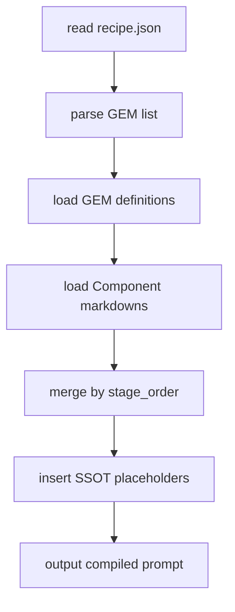

# 模組化提示詞管理方法論
(Modular Prompt Management Methodology)

## 一、導論：從提示詞到模組化系統

在傳統的提示詞工程中，每個 prompt 都是獨立存在的文字檔案。
這樣做雖然容易上手，但在多專案、多版本、多角色的環境下會帶來三大問題：

* **難以維護**：每個 prompt 都重複相同邏輯。
* **難以共享**：功能無法被其他專案共用。
* **難以追蹤**：提示詞演進歷史難以版本控制。

**GEM 方法論**（*Generative Element Module Methodology*）
提出一種結構化思維：

> 把提示詞當作「可組合的模組 (GEM)」，
> 像程式庫一樣儲存、版本化、組裝與測試。

---

## 二、核心原則（The Core Principles）

| 原則 | 名稱            | 核心理念                | 實踐方式                               |
| -- | ------------- | ------------------- | ---------------------------------- |
| P1 | 提示詞即程式碼 (PaC) | Prompt 應像程式一樣被組裝與測試 | 每個模組獨立維護                           |
| P2 | 單一職責原則 (SRP)  | 每個 component 只做一件事  | `fn_*.md` 對應單一功能                   |
| P3 | 關注點分離 (SoC)   | 資料、邏輯、組裝分開          | `components/`, `gems/`, `recipes/` |
| P4 | 組合優於繼承        | 用組裝取代複製修改           | GEM = Component 的組合                |
| P5 | DRY 原則        | 不重複功能邏輯             | 共用 component 檔案                    |
| P6 | 宣告式建構         | 用 JSON 宣告而非手動拼字     | Recipe 指定組合清單                      |
| P7 | SSOT 通訊介面     | 所有模組共享單一狀態          | 經由 SSOT（如 R0）傳遞資料                  |
| P8 | 可測試性          | 模組化可分層測試            | 單元測試 + 整合測試                        |

---

## 三、GEM 系統資料結構

### 📂 範例結構

```
core/
 └─ prompts/
     ├─ components/           # 功能模組（最小單位）
     │   ├─ fn_analyze_intent.md
     │   ├─ fn_generate_summary.md
     │   └─ fn_format_json_output.md
     ├─ gems/                 # 組合模組（GEM）
     │   ├─ gem_knowledge_extractor.json
     │   └─ gem_code_audit.json
     ├─ registry/             # 已發布 GEM 索引
     │   ├─ index.json
     │   └─ gem_knowledge_extractor@1.0.0.json
     └─ tools/                # 工具組
         ├─ build_prompt.py
         ├─ prompt_preview.py
         └─ publish_gem.py
```

---

## 四、模組層級設計

### 1️⃣ Component（功能模組）

> 單一提示詞功能。每個檔案處理一個特定任務。

```markdown
---
name: fn_analyze_intent
version: 1.0.0
reads: ["user_input"]
writes: ["project_spec.intent"]
contracts:
  output_type: string
---

請根據以下輸入判斷使用者意圖，輸出為一段簡短文字。
```

---

### 2️⃣ GEM（組合模組）

> 結合多個功能模組，形成具邏輯關聯的完整任務流。

```json
{
  "name": "gem_knowledge_extractor",
  "version": "1.0.0",
  "description": "抽取知識並生成摘要",
  "modules": [
    {"name": "fn_analyze_intent"},
    {"name": "fn_generate_summary"},
    {"name": "fn_format_json_output"}
  ],
  "io_rules": {
    "authorize_writes": {
      "fn_analyze_intent": ["project_spec.intent"],
      "fn_generate_summary": ["project_spec.summary"],
      "fn_format_json_output": ["project_spec.report"]
    },
    "stage_order": ["intent", "summary", "report"]
  }
}
```

---

### 3️⃣ Recipe（組裝宣告）

> 宣告最終應用要使用哪些 GEM。

```json
{
  "name": "spec_demo_research",
  "use_gems": [
    {"name": "gem_knowledge_extractor", "version": "1.0.0"}
  ]
}
```

---

## 五、組裝流程（以 build_prompt.py 為例）



---

## 六、VS Code 開發與 GitHub 版本管理

| 階段   | 動作                 | 工具                  |
| ---- | ------------------ | ------------------- |
| 編輯   | 修改 component / GEM | VS Code             |
| 組裝   | build_prompt.py    | Terminal / Task     |
| 預覽   | prompt_preview.py  | VS Code Output      |
| 測試   | pytest / eval      | Testing Panel       |
| 發佈   | publish_gem.py     | CLI / GitHub Action |
| 版本控管 | git tag / registry | GitHub + index.json |

---

### 🧠 GEM 在 VS Code 中的開發流程

1️⃣ **開啟 GEM JSON**

* 修改組件順序、版本範圍、授權欄位。
* VS Code 自動提供 JSON schema 驗證。

2️⃣ **測試組裝結果**

```bash
python core/prompts/tools/build_prompt.py \
  --recipe dev/projects/proj-A/prompts/recipes/demo_research.json \
  --registry core/prompts/registry
```

3️⃣ **預覽成品**

```bash
python core/prompts/tools/prompt_preview.py \
  --recipe dev/projects/proj-A/prompts/recipes/demo_research.json
```

4️⃣ **提交版本**

```bash
git add core/prompts/gems/gem_knowledge_extractor.json
git commit -m "feat: add report formatting stage"
git push origin main
```

---

## 七、Registry 與版本治理

| 元件              | 儲存位置                                 | 管理方式       |
| --------------- | ------------------------------------ | ---------- |
| Component       | `core/prompts/components/`           | 單檔維護       |
| GEM             | `core/prompts/gems/`                 | JSON 結構版本化 |
| Registry        | `core/prompts/registry/`             | 存放正式發布版本   |
| Lockfile        | `dev/projects/proj-X/gems.lock.json` | 鎖定使用版本     |
| Compiled Prompt | `compiled_prompts/`                  | 自動生成，不手動編輯 |

---

### GEM 發佈流程

```bash
python core/prompts/tools/publish_gem.py \
  --name gem_knowledge_extractor \
  --version 1.0.1
```

自動產生：

* `registry/gem_knowledge_extractor@1.0.1.json`
* 更新 `index.json`
* 計算 SHA
* 發佈版本 tag

---

## 八、GEM 方法論的核心價值

| 面向   | 成果                         |
| ---- | -------------------------- |
| 可組裝  | 用 GEM 宣告式組裝功能模組            |
| 可重用  | 相同模組可跨專案引用                 |
| 可版本化 | 每個 GEM 可獨立升級與鎖定版本          |
| 可審計  | registry + lockfile 完整追蹤來源 |
| 可測試  | 每個 GEM 可做單元與整合測試           |
| 可擴展  | 新 GEM 可自由疊加組裝不破壞舊版         |

---

> **總結：**
>
> GEM 是「提示詞的中階邏輯單元」。
> 它讓 Prompt 從靜態文字升級為「可編譯、可版本、可測試」的工程模組。
> 當程式碼方法論是軟體的骨架，GEM 方法論就是 AI 工程的神經系統。

---

是否要我接著生成第三份：
📘《程式碼 × GEM 整合方法論》 (Unified Modular Integration Methodology)?

