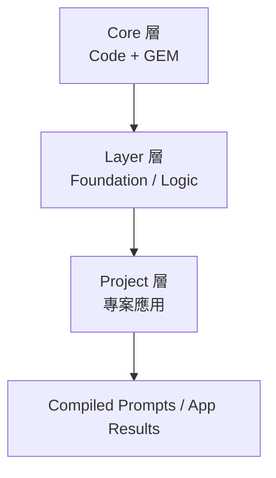
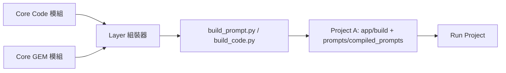
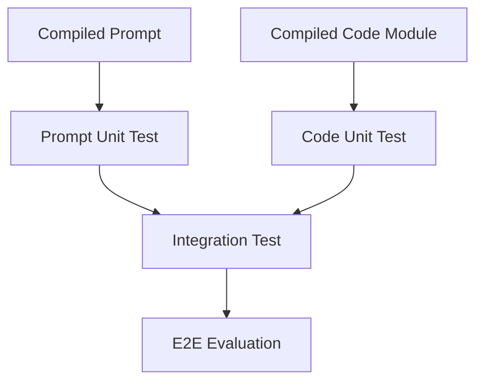

# 《專案層級整合方法論》
*(Full Project Integration Methodology – Layered, Unified, Scalable)*

---

## 一、導論：專案為核心，層級為秩序

隨著 **程式碼模組** 與 **GEM 模組** 被治理得越來越穩定，
下一步的挑戰是：**如何讓專案層級的開發流程變得有秩序、有邏輯、有重用性。**

傳統專案常見問題：

* 每個專案有自己的資料結構、邏輯重複。
* 專案間版本不一致、依賴混亂。
* 開發者各自為政，導致系統無法整合。

**專案層級整合方法論 (Full Project Integration Methodology)**
將整個系統治理邏輯上升到三層：

> **核心層 (Core)**：統一的程式與 GEM 資產庫
> **開發層 (Layer)**：功能與框架層（定義作業邏輯）
> **專案層 (Project)**：實際應用層（執行與交付）

這是一個由上而下的統一架構：

> 🧩 **層級在上，專案在下**，
> 專案只是層級的應用，不再是獨立的孤島。

---

## 二、核心原則（Layered Project Principles）

| 原則 | 名稱          | 核心理念                    | 實踐方式                        |
| -- | ----------- | ----------------------- | --------------------------- |
| P1 | 層級主導        | 以層級架構驅動專案               | 開發層管理通用邏輯                   |
| P2 | 專案為應用       | 專案不再自定義核心邏輯             | 專案只引用 Layer 功能              |
| P3 | 核心統一        | 所有專案共用 Core（Code + GEM） | core 資料夾集中治理                |
| P4 | 宣告式組裝       | 用 JSON 宣告專案依賴           | recipes / config            |
| P5 | Lockfile 鎖定 | 每個專案版本鎖定組件              | `gems.lock.json`            |
| P6 | 雙軌整合        | 專案同時調用 Code + GEM       | build_prompt.py + Service 層 |
| P7 | 平台化治理       | 全專案由 CI/CD 驗證與發佈        | GitHub Actions pipeline     |
| P8 | 視覺化操作       | VS Code 為操作界面           | Tasks + Catalog Preview     |

---

## 三、專案層級資料結構

### 📦 目錄結構（全域架構）

```
/modular-ai-system/
├─ core/                    # 核心層（不可被專案直接修改）
│   ├─ code/
│   └─ prompts/
│
├─ dev/                     # 開發層（邏輯與框架）
│   ├─ layers/
│   │   ├─ foundation/
│   │   ├─ logic/
│   │   └─ interface/
│   └─ projects/            # 專案層
│       ├─ proj-A/
│       │   ├─ ssot/schema.json
│       │   ├─ app/
│       │   ├─ prompts/
│       │   │   ├─ recipes/
│       │   │   ├─ compiled_prompts/
│       │   │   └─ evals/
│       │   ├─ gems.lock.json
│       │   └─ tests/
│       └─ proj-B/
│
└─ docs/
    ├─ methods/
    └─ prompt_catalog.html
```

---

## 四、層級關係與職責分工

| 層級            | 職責                 | 範例                        |
| ------------- | ------------------ | ------------------------- |
| **Core 層**    | 維護全域模組（Code + GEM） | core/code/, core/prompts/ |
| **Layer 層**   | 抽象共用邏輯、封裝框架        | dev/layers/logic/         |
| **Project 層** | 應用與交付，負責整合         | dev/projects/proj-A/      |

---

### 🧩 資料流方向



* Core 層提供標準邏輯模組
* Layer 層定義組裝方式
* Project 層執行組裝並產出成品

---

## 五、專案層級操作流程

### 1️⃣ 建立新專案

```bash
cd dev/projects
cp -r _template proj-new
```

結構範例：

```
proj-new/
 ├─ ssot/schema.json
 ├─ prompts/recipes/spec_new_project.json
 ├─ gems.lock.json
 └─ app/
```

---

### 2️⃣ 指定所需 GEM

```json
{
  "name": "spec_new_project",
  "use_gems": [
    {"name": "gem_knowledge_extractor", "version": "1.0.1"},
    {"name": "gem_code_audit", "version": "0.9.2"}
  ]
}
```

---

### 3️⃣ 組裝與測試

```bash
python core/prompts/tools/build_prompt.py \
  --recipe dev/projects/proj-new/prompts/recipes/spec_new_project.json \
  --registry core/prompts/registry \
  --ssot dev/projects/proj-new/ssot/schema.json \
  --output dev/projects/proj-new/prompts/compiled_prompts
```

產出：

```
dev/projects/proj-new/prompts/compiled_prompts/spec_new_project.md
```

---

### 4️⃣ 鎖定版本

```json
{
  "project": "proj-new",
  "gems": {
    "gem_knowledge_extractor": "1.0.1",
    "gem_code_audit": "0.9.2"
  },
  "compiled_at": "2025-11-06T10:00:00Z"
}
```

---

### 5️⃣ 測試與驗證

```bash
pytest dev/projects/proj-new/tests/
python core/prompts/tools/run_evals.py --project proj-new
```

---

### 6️⃣ 發佈與部署

GitHub Actions 會在 push 後：

1. 驗證 schema
2. 組裝並測試 prompts
3. 發佈 build artifact
4. 更新 registry 或 lockfile

---

## 六、跨專案共用策略

| 元件             | 共用方式    | 儲存位置                              |
| -------------- | ------- | --------------------------------- |
| Components     | 全域共用    | core/prompts/components/          |
| GEM            | 跨專案共用   | core/prompts/gems/                |
| Layer Modules  | 跨專案封裝   | dev/layers/logic/                 |
| Project Config | 專案專屬    | dev/projects/proj-X/              |
| SSOT Schema    | 可引用共用模板 | dev/layers/foundation/schema.json |

---

## 七、版本治理與自動化

### 🔧 CI/CD 工作流

`/.github/workflows/build.yml`

```yaml
name: Build & Validate All Projects
on: [push]
jobs:
  build:
    runs-on: ubuntu-latest
    steps:
      - uses: actions/checkout@v4
      - name: Set up Python
        uses: actions/setup-python@v5
        with:
          python-version: "3.11"
      - run: pip install -r requirements.txt
      - name: Validate All Recipes
        run: python core/prompts/tools/validate_spec.py
      - name: Build All Prompts
        run: make build-all
      - name: Run Project Tests
        run: pytest
```

---

## 八、VS Code 操作整合

| 功能        | 工具                | 描述             |
| --------- | ----------------- | -------------- |
| 開啟 Recipe | JSON 編輯器          | 指定 GEM 組合      |
| 組裝        | build_prompt.py   | 一鍵執行           |
| 預覽        | prompt_preview.py | 顯示結果           |
| 專案執行      | app/main.py       | 呼叫組裝結果         |
| 鎖定版本      | gems.lock.json    | 自動生成           |
| 發佈        | Git Push          | 觸發 CI Pipeline |

---

## 九、專案層級整合模型

```mermaid
graph TD
    C[Core (程式+GEM)] --> L[Layer (共用框架)]
    L --> P1[Project A]
    L --> P2[Project B]
    P1 --> E1[成果：Compiled Prompt A]
    P2 --> E2[成果：Compiled Prompt B]
```

---

## 十、價值與結論

| 面向      | 成果                       |
| ------- | ------------------------ |
| **統一性** | 全專案共用一套邏輯與架構             |
| **效率**  | 新專案可快速啟動，只需宣告組件          |
| **穩定性** | 所有組件皆有版本與測試流程            |
| **透明性** | VS Code 與 GitHub 可完整觀察內容 |
| **擴展性** | 新專案、新 Layer 可自由接入而不破壞核心  |

---
# 《Prompt & Coding 組裝方法論》
---

## 🧩 一、基本原則：組裝成品屬於「Project 層」

### ✳️ 原因：

* Core、Layer 是**可重用邏輯層**，不應該有「運行時產物」
* 組裝結果是**專案執行上下文**的結果（含特定版本、依賴、輸入結構）
* Prompt 與 Code 組裝後屬於「應用可執行單位」

👉 所以組裝好的成品**要放在 Project 層**的明確資料夾裡。

---

## 📦 二、建議目錄結構（完整範例）

```
dev/
 └─ projects/
     ├─ proj-A/
     │   ├─ app/                     # 組裝後的應用邏輯（Code）
     │   │   ├─ build/               # 自動組裝生成區
     │   │   │   ├─ modules/         # 組裝後可執行 Python 模組
     │   │   │   └─ pipelines/       # 組合後的流程
     │   │   ├─ main.py              # 專案進入點
     │   │   ├─ run.sh               # 執行腳本
     │   │   └─ config.yaml
     │   │
     │   ├─ prompts/
     │   │   ├─ recipes/             # 組裝宣告
     │   │   ├─ compiled_prompts/    # ✅ 組裝後成品（Prompt）
     │   │   ├─ evals/               # 測試用例
     │   │   └─ lockfile.json        # 組件版本鎖
     │   │
     │   ├─ ssot/schema.json         # 專案共用資料結構
     │   └─ tests/                   # 專案層測試
```

---

## ⚙️ 三、組裝與產出規範

| 類別             | 產出檔案            | 放置位置                        | 說明                   |
| -------------- | --------------- | --------------------------- | -------------------- |
| **組裝後 Code**   | `.py` / `.json` | `app/build/modules/`        | Layer 自動組合的邏輯模組      |
| **組裝後 Prompt** | `.md`           | `prompts/compiled_prompts/` | GEM + Component 組合結果 |
| **Recipe 宣告**  | `.json`         | `prompts/recipes/`          | 組裝配置來源               |
| **Lockfile**   | `.json`         | `prompts/lockfile.json`     | 指定版本依賴               |
| **測試與驗證**      | `.py` / `.yaml` | `tests/`                    | 驗證組裝成品是否能跑通          |
| **執行入口**       | `main.py`       | `app/`                      | 呼叫編譯後模組與 prompt      |

---

## 🧱 四、組裝流程（程式碼與 Prompt 並行）



1️⃣ Layer 組裝器（例如 `build_code.py`, `build_prompt.py`）
　→ 讀取 Core 內模組與 GEM 結構。
2️⃣ 解析 Project 的 Recipe / Config。
3️⃣ 組合成可執行模組或 prompt。
4️⃣ 成品存入 Project 專屬的組裝區。

---

## 🔧 五、組裝工具對應表

| 工具                  | 功能                            | 輸出位置                         |
| ------------------- | ----------------------------- | ---------------------------- |
| `build_code.py`     | 組合 Code 模組成可執行流程              | `app/build/modules/`         |
| `build_prompt.py`   | 組合 GEM + Component 成完整 Prompt | `prompts/compiled_prompts/`  |
| `prompt_preview.py` | 預覽 Prompt 組裝結果                | 終端輸出                         |
| `prompt_diff.py`    | 比較新舊版本差異                      | 終端輸出                         |
| `publish_gem.py`    | 發佈 GEM 版本                     | `core/prompts/registry/`     |
| `validate_spec.py`  | 驗證專案設定與 Schema                | `dev/projects/<proj>/tests/` |

---

## 🔐 六、執行層與測試層關係



* Prompt 與 Code 的組裝成品**各自測試**
* 最後由整合測試（Integration Test）驗證交互邏輯
* 最終用端對端測試（E2E）確認整體行為

---

## 💾 七、版本與產物治理

| 產物類型              | 管理策略                    |
| ----------------- | ----------------------- |
| Core Code / GEM   | 放在 `core/` 並由 GitHub 管理 |
| 組裝後 Code          | 不進 Git，僅做編譯產物           |
| 組裝後 Prompt        | 可選進 Git（若要審查或回溯）        |
| Recipe / Lockfile | 一定要進 Git（為版本證據）         |
| 測試結果 / Evals      | 可儲存在 `docs/evals/` 供回溯  |

> 💡 小建議：
> Prompt 的成品 `.md` 若屬關鍵任務，可以**納入 Git 並上傳審核記錄**；
> Code 的 build 結果通常由 CI 自動生成，不建議手動追蹤。

---

## 🧠 八、VS Code 實作建議

在 `.vscode/tasks.json` 中可新增兩個自動任務：

```json
{
  "version": "2.0.0",
  "tasks": [
    {
      "label": "🔧 Build Project Code",
      "type": "shell",
      "command": "python dev/layers/tools/build_code.py --project ${workspaceFolder}/dev/projects/proj-A",
      "group": "build"
    },
    {
      "label": "🧠 Build Project Prompt",
      "type": "shell",
      "command": "python core/prompts/tools/build_prompt.py --recipe ${workspaceFolder}/dev/projects/proj-A/prompts/recipes/spec_demo.json",
      "group": "build"
    }
  ]
}
```

這樣你只要在 VS Code 中按 **Ctrl + Shift + B**，
就能同時組裝 Code 與 Prompt，結果自動放入對應資料夾。

---

## ✅ 九、小結：存放邏輯一覽表

| 類別                   | 所屬層級    | 存放位置                                            | 是否版本控管  |
| -------------------- | ------- | ----------------------------------------------- | ------- |
| 核心模組 (Code/GEM)      | Core    | `core/`                                         | ✅       |
| 共用框架 (Layer)         | Layer   | `dev/layers/`                                   | ✅       |
| 組裝宣告 (Recipe/Config) | Project | `dev/projects/<proj>/prompts/recipes/`          | ✅       |
| 組裝成品 (Prompt)        | Project | `dev/projects/<proj>/prompts/compiled_prompts/` | ✅ / 可選  |
| 組裝成品 (Code)          | Project | `dev/projects/<proj>/app/build/`                | ❌（暫存產物） |
| 測試與評估                | Project | `dev/projects/<proj>/tests/`                    | ✅       |
| 文件與規範                | Docs    | `docs/methods/`                                 | ✅       |

---

> **一句話總結：**
> 組裝好的 Code 與 Prompt 不屬於 Core，也不屬於 Layer，
> 它們是「**專案層級的最終執行產物**」。
>
> 所以 ——
> ✅ Core 提供可重用邏輯，
> ✅ Layer 提供組裝與框架，
> ✅ Project 保存最終成品。

---

是否希望我幫你畫一張「**從 Core 到 Project 的產物流動與檔案歸屬圖**」？
用 Mermaid 直接視覺化每個輸出從哪裡來、存在哪裡、誰用到。
